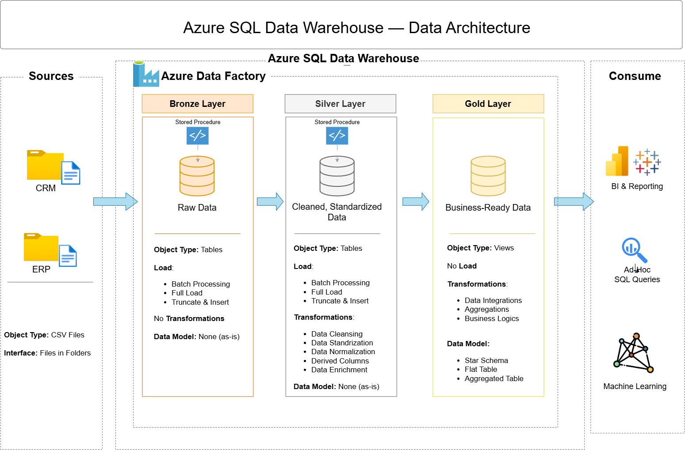

# 🏭 Azure SQL Data Warehouse — End-to-End Data Engineering Project

---

## 📌 Project Overview

An end-to-end data warehouse built from scratch on **Azure SQL Database**, implementing the **Medallion Architecture** (Bronze → Silver → Gold) using **T-SQL stored procedures**, orchestrated via **Azure Data Factory**.

The project simulates a real-world retail scenario where raw data arrives from two source systems — a **CRM system** and an **ERP system** — and needs to be transformed into a clean, analytics-ready warehouse to power business reporting in Power BI.

---

## 📐 Data Architecture

The pipeline follows a three-layer Medallion Architecture, all hosted within **Azure SQL Database** and orchestrated end-to-end by **Azure Data Factory**.

---

## 🥉 Bronze Layer — Raw Ingestion

Source CSV files from the CRM and ERP systems are stored in **Azure Blob Storage**. Azure Data Factory copies all 6 files into Bronze tables in Azure SQL Database using parallel Copy activities — no transformations applied, data loaded exactly as-is.

**Object Type:** Tables  
**Load Pattern:** Truncate & Insert (full refresh every run)  
**Transformations:** None — raw data preserved as received

---

## 🥈 Silver Layer — Cleansing & Standardisation

Once all Bronze loads complete, ADF triggers the Silver stored procedure `sp_load_silver`. This reads from Bronze and applies data quality rules before writing to Silver tables:

- Duplicate records removed using `ROW_NUMBER()` window function
- Inconsistent values standardised (e.g. gender normalised to `M` / `F` / `n/a`)
- Invalid dates cast and validated to `DATE` type
- NULL and blank values replaced with meaningful defaults
- Whitespace trimmed across all string columns

**Object Type:** Tables  
**Load Pattern:** Truncate & Insert  
**Transformations:** Cleansing, standardisation, normalisation, derived columns

---

## 🥇 Gold Layer — Star Schema

The Gold layer is built as **SQL views** on top of Silver tables — no physical data movement. Views always reflect the latest Silver data at query time and are connected directly to Power BI for reporting.

The Gold layer implements a **Sales Data Mart** using a star schema:

| Table | Type | Description |
|---|---|---|
| `gold.fact_sales` | Fact | Sales order lines — amounts, quantities, dates |
| `gold.dim_customers` | Dimension | Customer demographics and geography |
| `gold.dim_products` | Dimension | Product details, category, subcategory |
| `gold.dim_date` | Dimension | Date hierarchy — year, month, quarter, week |

**Object Type:** Views  
**Load Pattern:** No load — query-time refresh  
**Transformations:** Data integration, aggregations, business logic

---

## 🔄 ADF Pipeline Orchestration

**Pipeline:** `pl_sales_dwh_full_load` | **Trigger:** Scheduled

ADF connects to **Azure Blob Storage** via `ls_blob_landing` (source) and to **Azure SQL Database** via `ls_azure_sql_dwh` (destination).

The pipeline runs in two stages:

**Stage 1 — Bronze (Parallel):** All 6 CSV files copied simultaneously to Bronze tables

| Activity | Source | Destination |
|---|---|---|
| `cp_crm_cust_info_to_bronze` | Blob CSV | `bronze.crm_cust_info` |
| `cp_crm_prd_info_to_bronze` | Blob CSV | `bronze.crm_prd_info` |
| `cp_crm_sales_to_bronze` | Blob CSV | `bronze.crm_sales_details` |
| `cp_erp_cust_to_bronze` | Blob CSV | `bronze.erp_cust_az12` |
| `cp_erp_loc_to_bronze` | Blob CSV | `bronze.erp_loc_a101` |
| `cp_erp_product_category_to_bronze` | Blob CSV | `bronze.erp_px_cat_g1v2` |

**Stage 2 — Silver (Sequential):** `sp_load_silver` stored procedure triggered only after all 6 Bronze activities complete successfully.

Gold views refresh automatically on query — no ADF step required.

---

## 📊 Power BI Dashboard

> 🚧 In Progress — connecting to Azure SQL Database Gold layer views.

---

## 👩‍💻 Author

**Pranusha Tirunagari**  
Data Engineer | Azure • Databricks • Synapse • Power BI  
📍 [LinkedIn](https://www.linkedin.com/in/pranusha-tirunagari-a583a63a8/) | [GitHub](https://github.com/Ptirunagari19)
